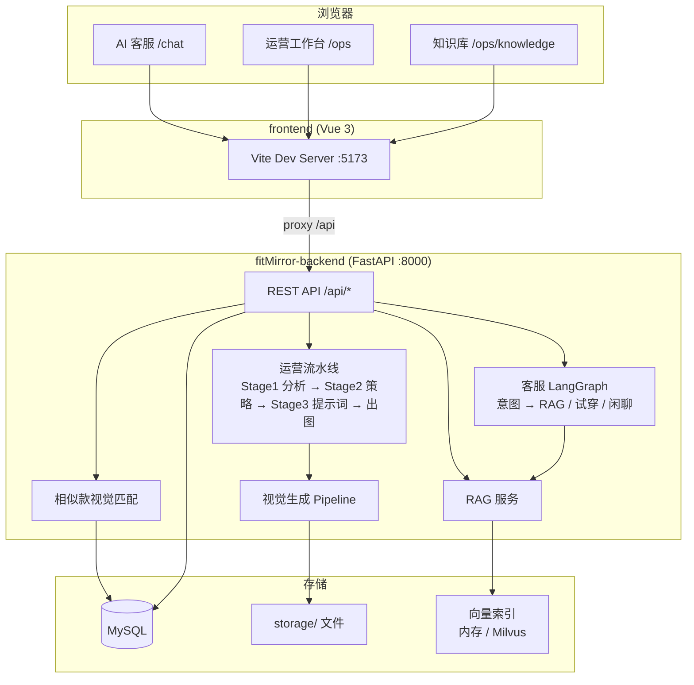

# fitMirror

[](LICENSE)

**fitMirror** 是一个面向电商场景的 AI 全链路演示项目：**虚拟试穿客服** + **运营视觉生成工作台**。

顾客可以像在微信里找客服一样，咨询商品、查退换货政策、发图找相似款、一键虚拟试穿；运营人员可以在同一套系统里管理 SKU、跑视觉分析流水线、生成营销策略与商品主图。后端基于 **FastAPI + LangGraph**，视觉生成能力迁移自 [PrismPix](https://github.com) 流水线思路，适合学习 AI 客服、RAG、多模态识图与 AIGC 出图的完整落地。

---

## 这个项目在做什么？

fitMirror 解决的是电商里两个常见场景：

### 1. 顾客侧 — AI 智能客服

- **多轮对话**：尺码推荐、发货/退换货查询、店铺商品浏览
- **发图识货**：用户发一张衣服照片，系统识别店内是否有相似款式，并主动引导试穿、选码
- **虚拟试穿**：结合用户身高体重，展示商品上身效果图
- **知识库问答**：基于 FAQ、话术、政策文档的 RAG 检索增强回答

### 2. 运营侧 — 视觉生成工作台

- **SKU 管理**：录入商品图、类目、风格、模特参考信息
- **AI 产品分析**：视觉模型分析商品材质、颜色、结构特征
- **营销策略生成**：自动产出卖点、场景、痛点等营销文案
- **提示词 + 批量出图**：生成主图 / 细节图 / Lookbook，支持人工确认后继续

两端共用同一套商品数据（MySQL）与存储，客服推荐的商品就是运营维护的 SKU。

---

## 界面预览

### 运营工作台 — SKU 管理与 AI 出图流水线

上传商品图 → 产品分析 → 营销策略 → 提示词 → 批量生成模特图 / 主图。


### AI 客服 — 虚拟试穿

用户说「我想试穿这件衣服」，系统结合身材数据返回上身效果图，并展示店铺商品目录。


### AI 客服 — 发图找相似款

用户发参考图 +「有类似的衣服吗？」，视觉模型匹配店内相似 SKU，导购式回复并引导试穿购买。


---

## 功能概览

| 模块 | 能力 |
|------|------|
| **AI 客服** | 多轮对话、意图路由（闲聊 / FAQ / 试穿）、LangGraph 编排 |
| **发图相似款** | 视觉模型（qwen-vl 等）对比用户图与店内 SKU；dHash + 启发式兜底 |
| **虚拟试穿** | 选择 SKU + 身材数据，返回试穿效果图画廊 |
| **运营工作台** | SKU CRUD、Stage1 分析 → Stage2 策略 → Stage3 提示词 → 出图 |
| **知识库** | 上传 FAQ / 话术 / 政策 / 商品说明（txt/md/pdf/docx），向量检索 |
| **商品目录** | 分类浏览、点击咨询、发图匹配、商品介绍卡片 |

---

## 项目结构

```
fitMirror/
├── docs/
│   └── images/                 # README 示例截图
├── fitMirror-backend/          # Python API（uv 管理，.venv 在本目录内）
│   ├── app/
│   │   ├── router/             # FastAPI 路由
│   │   ├── services/           # 业务逻辑（客服、识图、试穿等）
│   │   ├── graph/              # LangGraph 编排（客服图 / 运营图）
│   │   ├── pipeline/           # 视觉生成流水线
│   │   ├── rag/                # 文档解析 + 向量检索
│   │   ├── models/             # SQLAlchemy 模型
│   │   └── db/                 # 数据库配置
│   ├── scripts/                # 种子数据、快照恢复、自测脚本
│   ├── seed/
│   │   ├── images/             # 基础商品图
│   │   ├── knowledge/          # 知识库原文
│   │   └── snapshot/           # MySQL 演示快照 demo_db.json
│   ├── storage/                # 演示运行时文件（图片、workspace、向量索引）
│   ├── main.py
│   ├── pyproject.toml
│   └── uv.lock
├── frontend/                   # Vue 3 前端
│   └── src/
│       ├── views/customer/     # 客服聊天
│       └── views/ops/          # 运营台 + 知识库
└── README.md
```

---

## 技术栈

### 后端 `fitMirror-backend`

| 类别 | 技术 |
|------|------|
| 运行时 | Python 3.11+ |
| 包管理 | [uv](https://docs.astral.sh/uv/) |
| Web 框架 | FastAPI + Uvicorn |
| ORM | SQLAlchemy 2.0（async） |
| 数据库 | MySQL 8 |
| AI 编排 | LangGraph + LangChain |
| 向量库 | 内存索引（默认）/ Milvus（可选） |
| LLM | OpenAI 兼容 API / 阿里云 DashScope / Ollama |
| 图像 | Pillow、dHash、多模态视觉模型、AIGC 出图 |

### 前端 `frontend`

| 类别 | 技术 |
|------|------|
| 框架 | Vue 3 + Vite |
| UI | Element Plus |
| 路由 | Vue Router |
| HTTP | Axios |

---

## 系统架构



### 客服对话流

```
用户消息 → intent_router → ┬→ faq      → rag_reply（知识库检索 + LLM）
                          ├→ tryon    → check_profile → 试穿出图
                          └→ chat     → chat_reply（LLM）

用户发图 + 文本 → 精确识图（dHash）或 相似款推荐（视觉模型）→ 商品卡片 + 试穿引导
```

### 运营生成流

```
上传 SKU 图 → 分析产品(Stage1) → 营销策略(Stage2) → 人工确认
           → 生成提示词(Stage3) → 人工确认 → 批量生成图片
```

---

## 环境准备

### 必需

| 工具 | 版本 | 说明 |
|------|------|------|
| **Python** | ≥ 3.11 | 推荐 3.12 / 3.13 |
| **[uv](https://docs.astral.sh/uv/getting-started/installation/)** | 最新 | 后端依赖与虚拟环境管理 |
| **Node.js** | ≥ 18 | 前端构建与开发（推荐 22+） |
| **npm** | ≥ 9 | 随 Node 安装 |
| **MySQL** | 8.0+ | 业务数据库，默认库名 `fitmirror` |

安装 uv：

```bash
# Windows (PowerShell)
powershell -ExecutionPolicy ByPass -c "irm https://astral.sh/uv/install.ps1 | iex"

# macOS / Linux
curl -LsSf https://astral.sh/uv/install.sh | sh
```

### 可选

| 组件 | 用途 | 默认替代方案 |
|------|------|--------------|
| **Redis** | 分布式限流 | 内存限流 |
| **Milvus** | 大规模向量检索 | 内存向量库 + JSON 持久化 |
| **Ollama** | 本地 LLM | OpenAI / DashScope API |
| **LLM API Key** | 对话、识图、出图 | 部分 UI 可本地调试，核心 AI 能力需配置 Key |

---

## 快速开始

### 1. 克隆仓库

```bash
git clone https://gitee.com/yuyu_666/fit-mirror.git fitMirror
# 或 GitHub: git clone https://github.com/15170719135/fit-mirror.git fitMirror
cd fitMirror
```

### 2. 一键恢复演示环境（推荐）

仓库已附带作者本地的 **完整演示数据**：

- `fitMirror-backend/storage/` — 商品图、AI 生成图、workspace 缓存、向量索引（约 80MB）
- `fitMirror-backend/seed/snapshot/demo_db.json` — MySQL 演示记录（SKU、知识库、客服会话、出图任务等）

```bash
cd fitMirror-backend
uv sync
cp .env.example .env   # 配置 MYSQL_* 与 LLM Key

# 创建数据库（MySQL 中执行一次）:
# CREATE DATABASE fitmirror CHARACTER SET utf8mb4 COLLATE utf8mb4_unicode_ci;

# 一键恢复表结构 + 导入演示数据（使用仓库内 storage/，无需重新出图）
uv run python scripts/restore_demo_environment.py
```

恢复完成后，打开客服页即可看到：6 款商品、试穿效果图、相似款推荐会话、运营台已分析的 SKU 等。

> 若只需空白库 + 基础种子数据，可用旧脚本：`uv run python scripts/init_mysql.py`

### 3. 启动后端

```bash
cd fitMirror-backend
uv run uvicorn main:app --host 127.0.0.1 --port 8000 --reload
```

API 文档：http://127.0.0.1:8000/docs

### 4. 启动前端

```bash
cd frontend
npm install
npm run dev
```

访问：http://localhost:5173

| 路由 | 页面 |
|------|------|
| `/chat` | AI 客服 |
| `/ops` | 运营工作台（SKU + 生成流水线） |
| `/ops/knowledge` | 知识库管理 |

### 5. 补充演示数据（可选）

若 `restore_demo_environment.py` 后想重置为作者最新快照：

```bash
cd fitMirror-backend
uv run python scripts/restore_demo_environment.py --force
```

维护者更新快照并提交：

```bash
uv run python scripts/export_demo_snapshot.py
git add seed/snapshot/demo_db.json storage/
```

---

## 配置说明

配置文件：`fitMirror-backend/.env`（参考 `.env.example`）

### 数据库（MySQL）

```env
DB_TYPE=mysql
MYSQL_USER=root
MYSQL_PASSWORD=your_password
MYSQL_HOST=localhost
MYSQL_PORT=3306
MYSQL_DATABASE=fitmirror
```

> 项目统一使用 MySQL，请确保服务已启动。

### LLM（OpenAI 兼容 / DashScope / Ollama）

```env
# 阿里云 DashScope 示例
API_PROVIDER=dashscope
OPENAI_API_KEY=your_key
BASE_URL=https://dashscope.aliyuncs.com/compatible-mode/v1
VISION_MODEL=qwen-vl-max
TEXT_MODEL=qwen-max
IMAGE_MODEL=qwen-image-2.0-pro-2026-04-22
```

发图相似款、产品分析、出图等功能依赖视觉 / 文本 / 图像模型，请按实际供应商填写。

### 向量库

```env
USE_MILVUS=false
MILVUS_HOST=localhost
MILVUS_PORT=19530
```

`USE_MILVUS=false` 时使用内存向量库，索引持久化到 `storage/vectors/kb_index.json`。

---

## 开发指南

### 常用命令

```bash
# 后端 — 在 fitMirror-backend 目录下
uv sync
uv run uvicorn main:app --reload
uv run python scripts/test_ui_smoke.py
uv run python scripts/test_cs_features.py
uv run python scripts/test_similar_product.py   # 发图相似款
uv run python scripts/test_knowledge.py
uv run python scripts/verify_fixes.py

# 前端 — 在 frontend 目录下
npm run dev
npm run build
```

### API 模块

| 前缀 | 说明 |
|------|------|
| `/api/health` | 健康检查、DB / LLM 状态 |
| `/api/chat/*` | 会话、消息、试穿、商品目录、图文合并 |
| `/api/sku/*` | SKU CRUD、workspace、商品图 |
| `/api/generation/*` | 运营流水线启停、任务进度 |
| `/api/knowledge/*` | 知识库上传、预览、删除 |
| `/api/metadata` | 下拉元数据（类目、风格、平台等） |
| `/storage/*` | 静态文件（上传图、生成图） |

### 核心实现要点

1. **LangGraph 状态机**：客服与运营使用不同的 Graph，状态见 `app/graph/state.py`
2. **人机协同**：运营流水线在 `campaign` / `prompts` 阶段暂停，等待确认后继续
3. **RAG**：文档解析 → 分块 → 向量入库 → 检索增强回答
4. **发图识货**：同款用 dHash；相似款用视觉模型对比用户图与 SKU 图（`similar_product_service.py`）
5. **路径规范**：数据库存相对路径，由 `path_tool.resolve_storage_path` 解析

---

## 自测脚本

| 脚本 | 说明 |
|------|------|
| `scripts/restore_demo_environment.py` | **一键恢复完整演示环境（推荐）** |
| `scripts/export_demo_snapshot.py` | 维护者导出现有 MySQL 快照 |
| `scripts/init_mysql.py` | 空白库 + 基础种子（不含完整演示） |
| `scripts/seed_demo_data.py` | 补充 SKU / 知识库 |
| `scripts/test_ui_smoke.py` | 端到端冒烟（需前后端已启动） |
| `scripts/test_cs_features.py` | 客服功能自测 |
| `scripts/test_similar_product.py` | 发图相似款推荐 |
| `scripts/test_knowledge.py` | 知识库 CRUD |
| `scripts/verify_fixes.py` | 安全与并发回归 |

---

## 开源说明

本项目以 **MIT License** 开源，欢迎 Star、Issue 与 PR。

**学习向项目**，适合用来了解：

- AI 客服的对话编排与意图路由
- RAG 知识库在电商场景的接入方式
- 多模态发图识货与导购转化话术
- 运营侧 AIGC 流水线的人机协同设计

部署到公网前请注意：

- 增加鉴权（当前 API 面向本地演示，无登录）
- 限制 `/storage` 公开访问范围
- 勿将 `.env` 中的 API Key 提交到仓库

---

## License

MIT — 详见 [LICENSE](LICENSE) 文件。
