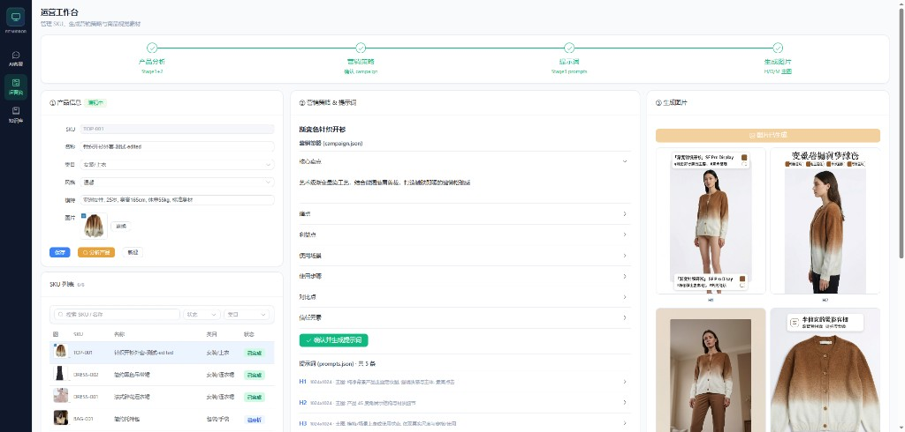
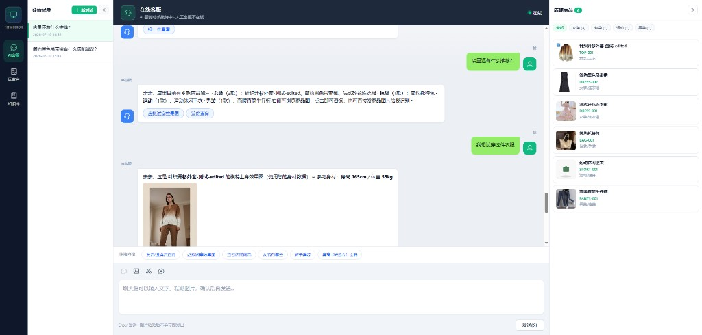
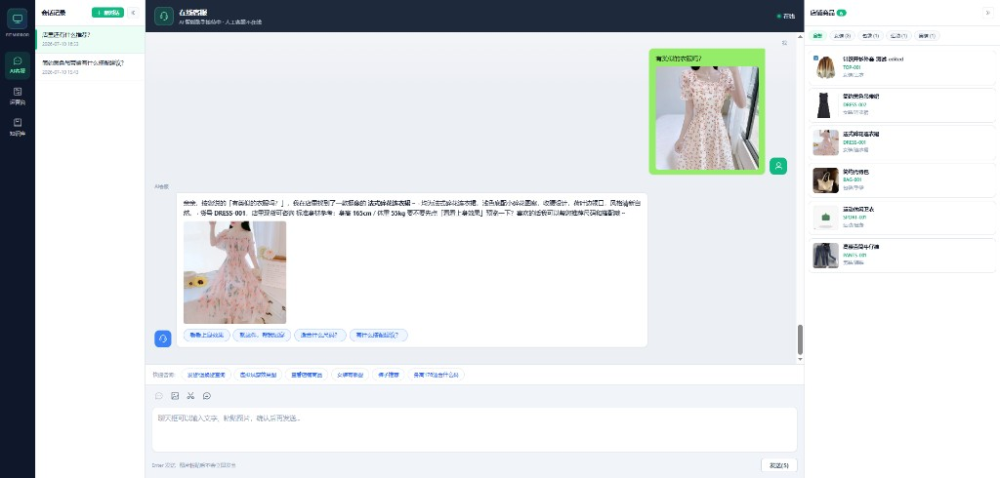
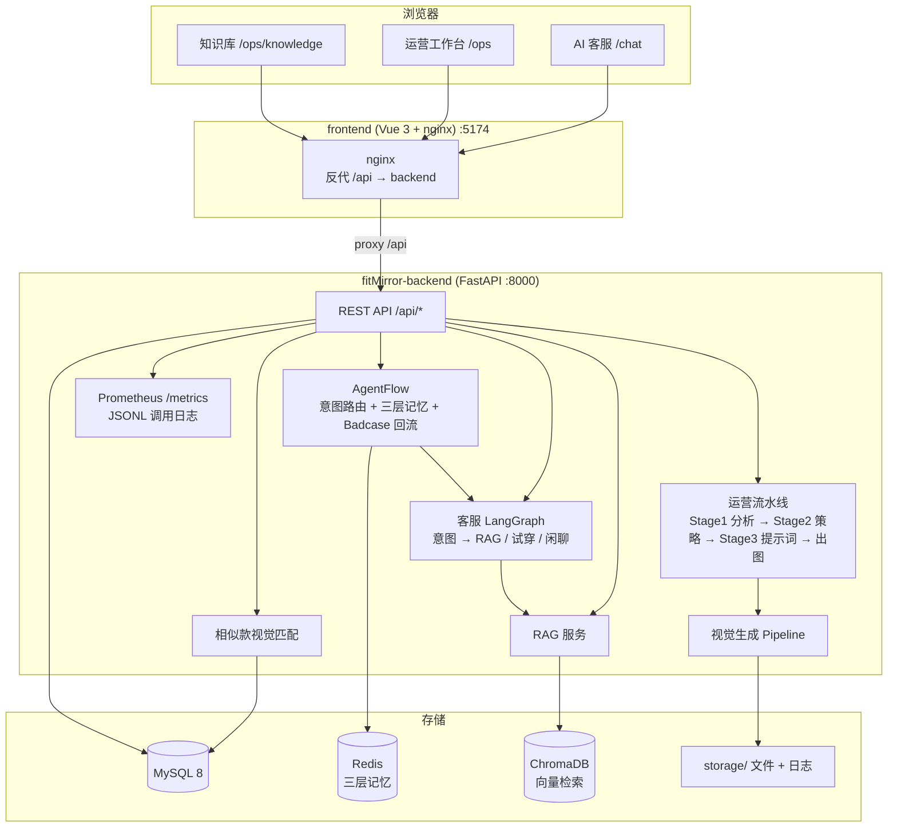

# fitMirror

[](LICENSE)

**fitMirror** 是一个面向电商场景的 AI 全链路演示项目：**虚拟试穿客服** + **运营视觉生成工作台**。

顾客可以像在微信里找客服一样，咨询商品、查退换货政策、发图找相似款、一键虚拟试穿；运营人员可以在同一套系统里管理 SKU、跑视觉分析流水线、生成营销策略与商品主图。后端基于 **FastAPI + LangGraph**，视觉生成能力迁移自 [PrismPix](https://github.com) 流水线思路，适合学习 AI 客服、RAG、多模态识图与 AIGC 出图的完整落地。

---

## 这个项目在做什么？

fitMirror 解决的是电商里两个常见场景：

### 1. 顾客侧 — AI 智能客服

- **多轮对话**：尺码推荐、发货/退换货查询、店铺商品浏览
- **发图识货**：用户发一张衣服照片，系统识别店内是否有相似款式，并主动引导试穿、选码
- **虚拟试穿**：结合用户身高体重，展示商品上身效果图
- **知识库问答**：基于 FAQ、话术、政策文档的 RAG 检索增强回答

### 2. 运营侧 — 视觉生成工作台

- **SKU 管理**：录入商品图、类目、风格、模特参考信息
- **AI 产品分析**：视觉模型分析商品材质、颜色、结构特征
- **营销策略生成**：自动产出卖点、场景、痛点等营销文案
- **提示词 + 批量出图**：生成主图 / 细节图 / Lookbook，支持人工确认后继续

两端共用同一套商品数据（MySQL）与存储，客服推荐的商品就是运营维护的 SKU。

---

## 界面预览

### 运营工作台 — SKU 管理与 AI 出图流水线

上传商品图 → 产品分析 → 营销策略 → 提示词 → 批量生成模特图 / 主图。



### AI 客服 — 虚拟试穿

用户说「我想试穿这件衣服」，系统结合身材数据返回上身效果图，并展示店铺商品目录。



### AI 客服 — 发图找相似款

用户发参考图 +「有类似的衣服吗？」，视觉模型匹配店内相似 SKU，导购式回复并引导试穿购买。



---

## 功能概览

| 模块 | 能力 |
|------|------|
| **AI 客服** | 多轮对话、意图路由（闲聊 / FAQ / 试穿）、LangGraph 编排 |
| **AgentFlow** | 意图三路融合（Pattern + Embedding + LLM）、takeover 接管、Badcase 半自动回流 |
| **发图相似款** | 视觉模型（Qwen3-VL）对比用户图与店内 SKU；dHash + 启发式兜底 |
| **虚拟试穿** | 选择 SKU + 身材数据，返回试穿效果图画廊 |
| **运营工作台** | SKU CRUD、Stage1 分析 → Stage2 策略 → Stage3 提示词 → 出图 |
| **知识库** | 上传 FAQ / 话术 / 政策 / 商品说明（txt/md/pdf/docx），ChromaDB 向量检索 |
| **商品目录** | 分类浏览、点击咨询、发图匹配、商品介绍卡片 |
| **可观测性** | Prometheus 指标、API 调用链路日志（JSONL）、AgentFlow 运行时指标 |

---

## 项目结构

```
fitMirror/
├── docs/
│   └── images/                 # README 示例截图
├── fitMirror-backend/          # Python API（uv 管理，.venv 在本目录内）
│   ├── app/
│   │   ├── router/             # FastAPI 路由
│   │   ├── services/           # 业务逻辑（客服、识图、试穿等）
│   │   ├── graph/              # LangGraph 编排（客服图 / 运营图）
│   │   ├── agentflow_adapter/ # AgentFlow：意图路由 / 三层记忆 / Badcase 回流 / 监控
│   │   ├── pipeline/           # 视觉生成流水线
│   │   ├── rag/                # 文档解析 + 向量检索（ChromaDB / Milvus / 内存）
│   │   ├── models/             # SQLAlchemy 模型
│   │   └── db/                 # 数据库配置
│   ├── scripts/                # 种子数据、快照恢复、自测脚本
│   ├── seed/
│   │   ├── images/             # 基础商品图
│   │   ├── knowledge/          # 知识库原文
│   │   └── snapshot/           # MySQL 演示快照 demo_db.json
│   ├── storage/                # 演示运行时文件（图片、workspace、向量索引、日志）
│   ├── main.py
│   ├── requirements.txt        # Docker / 服务器 pip 安装
│   ├── pyproject.toml
│   └── uv.lock
├── frontend/                   # Vue 3 前端
│   ├── Dockerfile              # 前端容器（多阶段：npm build + nginx）
│   ├── nginx.conf              # 反代 /api → backend:8000
│   └── src/
│       ├── views/customer/     # 客服聊天
│       └── views/ops/          # 运营台 + 知识库
├── docker-compose.yml          # 一键部署（MySQL + Redis + ChromaDB + 后端 + 前端）
└── README.md
```

---

## 技术栈

### 后端 `fitMirror-backend`

| 类别 | 技术 |
|------|------|
| 运行时 | Python 3.11+ |
| 包管理 | [uv](https://docs.astral.sh/uv/)（本地开发）/ pip + requirements.txt（Docker） |
| Web 框架 | FastAPI + Uvicorn |
| ORM | SQLAlchemy 2.0（async） + PyMySQL |
| 数据库 | MySQL 8 |
| 缓存 / 记忆 | Redis（三层记忆持久化，关闭则降级进程内存） |
| AI 编排 | LangGraph + LangChain |
| 向量库 | ChromaDB（默认）/ Milvus（可选）/ 内存（回退） |
| LLM 文本 | DeepSeek API（OpenAI 兼容格式） |
| 视觉 / 出图 / Embedding | 硅基流动 SiliconFlow（Qwen3-VL / Qwen-Image-Edit / BGE-M3） |
| 图像处理 | Pillow、dHash、多模态视觉模型、AIGC 出图 |
| 监控 | Prometheus 指标（自定义实现）、JSONL 调用链路日志 |

### 前端 `frontend`

| 类别 | 技术 |
|------|------|
| 框架 | Vue 3 + Vite |
| UI | Element Plus |
| 路由 | Vue Router |
| HTTP | Axios |

---

## 系统架构



### AgentFlow 架构（客服侧核心）

AgentFlow 是客服侧的意图路由与编排层，支持**渐进式接管**业务路径：

- **执行模式**：`shadow`（旁路观察）/ `takeover`（接管业务路径，默认）
- **意图三路融合**：Pattern 规则 + Embedding 语义 + LLM Judge，三者任一失败自动降级
- **Agent 开关**：CatalogAgent / PolicyRAGAgent / TryOnAgent / ProductAdvisorAgent 独立开关
- **三层记忆**：L1 工作记忆 / L2 会话摘要 / L3 用户画像，Redis 持久化（关闭降级进程内存）
- **Badcase 回流**：半自动流程，运营填写期望回复后自动生成规则（权重 0.6×，低于人工规则）

### 客服对话流

```
用户消息 → intent_router → ┬→ faq      → rag_reply（知识库检索 + LLM）
                          ├→ tryon    → check_profile → 试穿出图
                          └→ chat     → chat_reply（LLM）

用户发图 + 文本 → 精确识图（dHash）或 相似款推荐（视觉模型）→ 商品卡片 + 试穿引导
```

### 运营生成流

```
上传 SKU 图 → 分析产品(Stage1) → 营销策略(Stage2) → 人工确认
           → 生成提示词(Stage3) → 人工确认 → 批量生成图片
```

---

## 环境准备

### 必需

| 工具 | 版本 | 说明 |
|------|------|------|
| **Python** | ≥ 3.11 | 推荐 3.12 / 3.13 |
| **[uv](https://docs.astral.sh/uv/getting-started/installation/)** | 最新 | 后端依赖与虚拟环境管理 |
| **Node.js** | ≥ 18 | 前端构建与开发（推荐 22+） |
| **npm** | ≥ 9 | 随 Node 安装 |
| **MySQL** | 8.0+ | 业务数据库，默认库名 `fitmirror` |

安装 uv：

```bash
# Windows (PowerShell)
powershell -ExecutionPolicy ByPass -c "irm https://astral.sh/uv/install.ps1 | iex"

# macOS / Linux
curl -LsSf https://astral.sh/uv/install.sh | sh
```

### 可选

| 组件 | 用途 | 默认替代方案 |
|------|------|--------------|
| **Redis** | 三层记忆持久化（L1/L2/L3） | 进程内存（重启丢失） |
| **ChromaDB** | 向量语义检索 | 内存向量库 + JSON 持久化 |
| **Milvus** | 大规模向量检索 | ChromaDB / 内存向量库 |
| **Docker** | 一键容器化部署 | 手动启动各组件 |

---

## 快速开始

提供两种启动方式：**Docker Compose 一键部署**（推荐服务器/演示）或 **本地裸机开发**。

### 方式 A：Docker Compose 一键部署（推荐）

适合服务器部署或面试演示，全套服务容器化、数据卷持久化。

```bash
git clone https://gitee.com/yuyu_666/fit-mirror.git fitMirror
# 或 GitHub: git clone https://github.com/15170719135/fit-mirror.git fitMirror
cd fitMirror

# 1. 根目录 .env（docker-compose 基础设施配置）
cp .env.example .env
# 按需改 MYSQL_ROOT_PASSWORD（默认 root123）

# 2. 后端 .env（API Key 必填）
cp fitMirror-backend/.env.example fitMirror-backend/.env
# 填入 DeepSeek API Key + 硅基流动 API Key

# 3. 一键启动（含 MySQL + Redis + ChromaDB + 后端 + 前端）
docker compose up -d --build
```

端口映射：

| 服务 | 容器端口 | 宿主机端口 | 说明 |
|------|---------|-----------|------|
| backend | 8000 | 8000 | FastAPI + Swagger 文档 |
| frontend | 80 | 5174 | nginx 托管前端 + 反代 /api |
| mysql | 3306 | 3306 | 数据库 |
| redis | 6379 | 6379 | 三层记忆持久化 |
| chromadb | 8000 | 8001 | 向量检索 |

验证：
```bash
docker compose ps                              # 容器状态
curl http://localhost:8000/api/health          # 后端健康检查
curl http://localhost:5174                     # 前端访问
```

### 方式 B：本地裸机开发

#### 1. 一键恢复演示环境（推荐）

仓库已附带作者本地的 **完整演示数据**：

- `fitMirror-backend/storage/` — 商品图、AI 生成图、workspace 缓存、向量索引（约 80MB）
- `fitMirror-backend/seed/snapshot/demo_db.json` — MySQL 演示记录（SKU、知识库、客服会话、出图任务等）

```bash
cd fitMirror-backend
uv sync
cp .env.example .env   # 配置 MYSQL_* 与 LLM Key

# 创建数据库（MySQL 中执行一次）:
# CREATE DATABASE fitmirror CHARACTER SET utf8mb4 COLLATE utf8mb4_unicode_ci;

# 一键恢复表结构 + 导入演示数据（使用仓库内 storage/，无需重新出图）
uv run python scripts/restore_demo_environment.py
```

恢复完成后，打开客服页即可看到：6 款商品、试穿效果图、相似款推荐会话、运营台已分析的 SKU 等。

> 若只需空白库 + 基础种子数据，可用旧脚本：`uv run python scripts/init_mysql.py`

#### 2. 启动后端

```bash
cd fitMirror-backend
uv run uvicorn main:app --host 127.0.0.1 --port 8000 --reload
```

API 文档：http://127.0.0.1:8000/docs

#### 3. 启动前端

```bash
cd frontend
npm install
npm run dev
```

访问：http://localhost:5174

> **端口约定**：前端固定 5174（5173 被其他项目占用），后端 8000，ChromaDB 8001，Redis 6379。

| 路由 | 页面 |
|------|------|
| `/chat` | AI 客服 |
| `/ops` | 运营工作台（SKU + 生成流水线） |
| `/ops/knowledge` | 知识库管理 |

#### 4. 补充演示数据（可选）

若 `restore_demo_environment.py` 后想重置为作者最新快照：

```bash
cd fitMirror-backend
uv run python scripts/restore_demo_environment.py --force
```

维护者更新快照并提交：

```bash
uv run python scripts/export_demo_snapshot.py
git add seed/snapshot/demo_db.json storage/
```

---

## 配置说明

配置文件：`fitMirror-backend/.env`（参考 `.env.example`）

### 数据库（MySQL）

```env
DB_TYPE=mysql
MYSQL_USER=root
MYSQL_PASSWORD=your_password
MYSQL_HOST=localhost
MYSQL_PORT=3306
MYSQL_DATABASE=fitmirror
```

> Docker 部署时，`MYSQL_HOST` 由 docker-compose 覆盖为 `mysql`，无需手动改。

### LLM（多提供商分离配置）

项目采用**多提供商架构**，文本/视觉/图像/Embedding 各走独立凭证：

```env
# 文本对话 → DeepSeek（OpenAI 兼容格式）
API_PROVIDER=openai
OPENAI_API_KEY=sk-your-deepseek-key
BASE_URL=https://api.deepseek.com/v1
TEXT_MODEL=deepseek-v4-pro

# 视觉识图 → 硅基流动（Qwen3-VL）
VISION_API_KEY=sk-your-siliconflow-key
VISION_BASE_URL=https://api.siliconflow.cn/v1
VISION_MODEL=Qwen/Qwen3-VL-8B-Instruct

# 图像生成（图生图） → 硅基流动（Qwen-Image-Edit）
IMAGE_API_KEY=sk-your-siliconflow-key
IMAGE_BASE_URL=https://api.siliconflow.cn/v1
IMAGE_MODEL=Qwen/Qwen-Image-Edit

# Embedding → 硅基流动（BGE-M3）
EMBED_API_KEY=sk-your-siliconflow-key
EMBED_BASE_URL=https://api.siliconflow.cn/v1
OPENAI_EMBED_MODEL=BAAI/bge-m3
```

> 视觉/图像/Embedding 的 Key 留空时，回退到主 `OPENAI_API_KEY` / `BASE_URL`。

### 向量库

```env
VECTOR_STORE=chroma
CHROMA_HOST=localhost
CHROMA_PORT=8001
CHROMA_COLLECTION=fitmirror_kb
```

`VECTOR_STORE` 不设或设为非 `chroma` 时，使用内存向量库，索引持久化到 `storage/vectors/kb_index.json`。Milvus 通过 `USE_MILVUS=true` 启用。

### Redis（三层记忆持久化）

```env
AGENTFLOW_MEMORY_REDIS_ENABLED=true
REDIS_URL=redis://localhost:6379/0
```

关闭时降级进程内存，L1 工作记忆 / L2 会话摘要 / L3 用户画像 在服务重启后丢失。

### AgentFlow（意图路由与接管）

```env
AGENTFLOW_EXECUTION_MODE=takeover          # shadow（旁路）/ takeover（接管）
AGENTFLOW_INTENT_LLM_ENABLED=true         # 意图 LLM Judge 开关
AGENTFLOW_CATALOG_ENABLED=false           # 各 Agent 独立开关
AGENTFLOW_POLICY_RAG_ENABLED=false
AGENTFLOW_TRYON_ENABLED=false
```

---

## 可观测性

### Prometheus 指标

```bash
curl http://localhost:8000/api/agentflow/metrics/prometheus
```

导出 AgentFlow 运行时指标（请求计数、延迟分布、Agent 选中次数、fallback 率），可用 Prometheus + Grafana 抓取。

### API 调用链路日志

每个 API 请求记录到 `fitMirror-backend/storage/logs/call_log_YYYYMMDD.jsonl`：

```json
{"ts":"2026-09-29 10:00:00.123","method":"POST","path":"/api/chat/send","status":200,"latency_ms":45.2,"client":"127.0.0.1","params":{"content":"试穿"},"error":null}
```

- 自动清理 7 天前的日志文件
- `/api/logs/calls` 路径本身不计入日志（避免自引用）
- 业务层错误通过 `X-Business-Error` header 捕获，写入 error 字段

前端在 API 调用日志页提供 20 条/页的分页查询。

---

## 开发指南

### 常用命令

```bash
# 后端 — 在 fitMirror-backend 目录下
uv sync
uv run uvicorn main:app --reload
uv run python scripts/test_ui_smoke.py
uv run python scripts/test_cs_features.py
uv run python scripts/test_similar_product.py   # 发图相似款
uv run python scripts/test_knowledge.py
uv run python scripts/verify_fixes.py

# 前端 — 在 frontend 目录下
npm run dev
npm run build

# Docker — 在项目根目录
docker compose up -d --build      # 启动
docker compose logs -f backend    # 看后端日志
docker compose down               # 停止
```

### API 模块

| 前缀 | 说明 |
|------|------|
| `/api/health` | 健康检查、DB / LLM 状态（llm_configured / llm_reachable / rag_available） |
| `/api/chat/*` | 会话、消息、试穿、商品目录、图文合并 |
| `/api/agentflow/*` | 意图路由检查、运行时指标、Prometheus 导出 |
| `/api/sku/*` | SKU CRUD、workspace、商品图 |
| `/api/generation/*` | 运营流水线启停、任务进度 |
| `/api/knowledge/*` | 知识库上传、预览、删除 |
| `/api/logs/calls` | API 调用日志分页查询（20 条/页） |
| `/api/metadata` | 下拉元数据（类目、风格、平台等） |
| `/metrics` | Prometheus 抓取端点 |
| `/storage/*` | 静态文件（上传图、生成图） |

### 核心实现要点

1. **LangGraph 状态机**：客服与运营使用不同的 Graph，状态见 `app/graph/state.py`
2. **AgentFlow 渐进式接管**：`shadow` 旁路观察不影响业务，`takeover` 接管业务路径；通过 `executed_route` 字段验证是否真正执行
3. **意图三路融合**：Pattern（规则）+ Embedding（语义）+ LLM Judge，固定意图枚举防 LLM 虚构，JSON 输出保证可解析
4. **三层记忆**：Redis 持久化 L1/L2/L3，关闭时降级进程内存
5. **人机协同**：运营流水线在 `campaign` / `prompts` 阶段暂停，等待确认后继续
6. **RAG**：文档解析（unstructured 结构化 / pypdf 兜底）→ 分块 → ChromaDB 入库 → 检索增强回答
7. **发图识货**：同款用 dHash；相似款用视觉模型对比用户图与 SKU 图（`similar_product_service.py`）
8. **路径规范**：数据库存相对路径，由 `path_tool.resolve_storage_path` 解析
9. **多提供商 LLM**：文本（DeepSeek）/ 视觉识图 / 图像生成 / Embedding 各自独立凭证，互不干扰

---

## 自测脚本

| 脚本 | 说明 |
|------|------|
| `scripts/restore_demo_environment.py` | **一键恢复完整演示环境（推荐）** |
| `scripts/export_demo_snapshot.py` | 维护者导出现有 MySQL 快照 |
| `scripts/init_mysql.py` | 空白库 + 基础种子（不含完整演示） |
| `scripts/seed_demo_data.py` | 补充 SKU / 知识库 |
| `scripts/test_ui_smoke.py` | 端到端冒烟（需前后端已启动） |
| `scripts/test_cs_features.py` | 客服功能自测 |
| `scripts/test_similar_product.py` | 发图相似款推荐 |
| `scripts/test_knowledge.py` | 知识库 CRUD |
| `scripts/verify_fixes.py` | 安全与并发回归 |

---

## 开源说明

本项目以 **MIT License** 开源，欢迎 Star、Issue 与 PR。

**学习向项目**，适合用来了解：

- AI 客服的对话编排与意图路由
- AgentFlow 渐进式接管与三路意图融合
- RAG 知识库在电商场景的接入方式
- 多模态发图识货与导购转化话术
- 运营侧 AIGC 流水线的人机协同设计
- 多提供商 LLM 架构（DeepSeek + 硅基流动）

部署到公网前请注意：

- 增加鉴权（当前 API 面向本地演示，无登录）
- 限制 `/storage` 公开访问范围
- 勿将 `.env` 中的 API Key 提交到仓库
- Docker 部署时修改默认 `MYSQL_ROOT_PASSWORD`

---

## License

MIT — 详见 [LICENSE](LICENSE) 文件。
