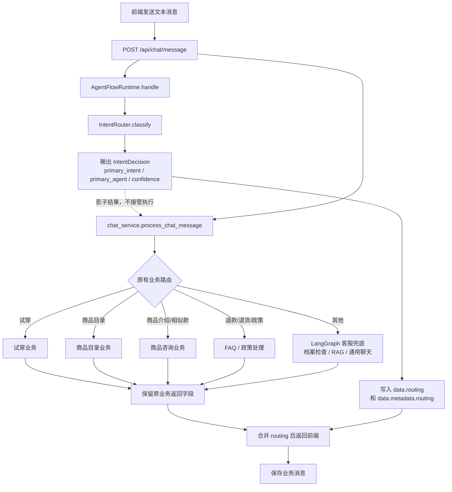
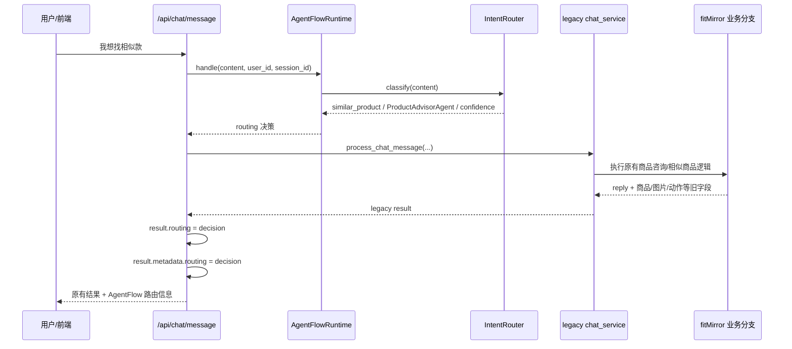
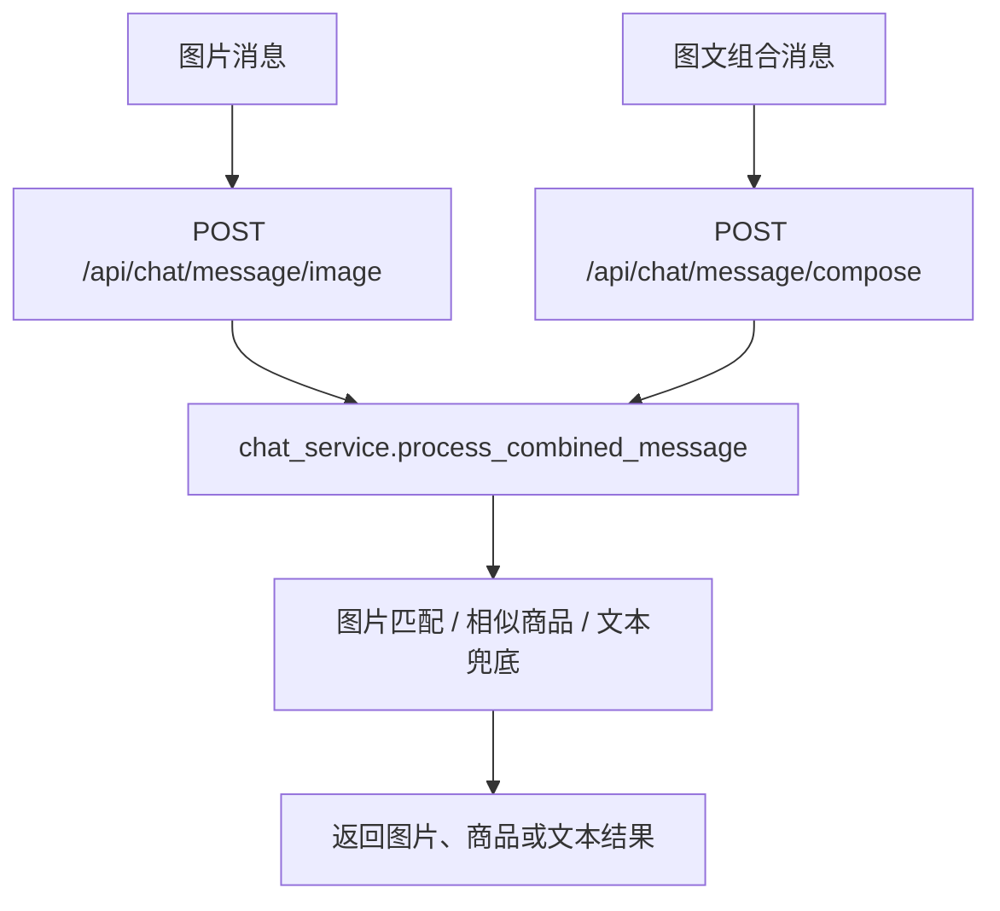
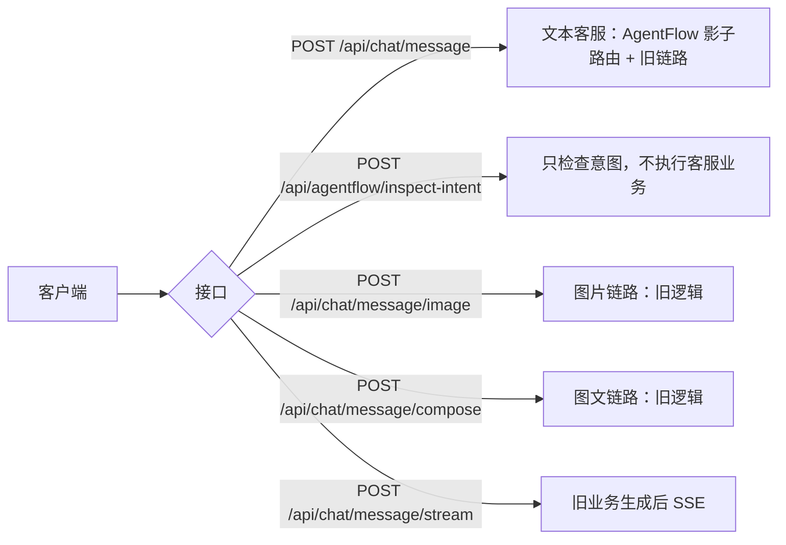
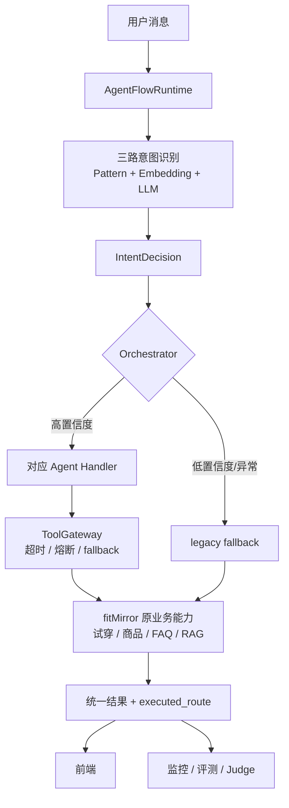

# AgentFlow × fitMirror 当前链路图

> 当前实现状态：AgentFlow 只做“影子意图路由”，不改变 fitMirror 原有业务执行分支。

## 1. 文本消息主链路



### 这张图最关键的一点

```text
AgentFlow 当前回答：应该由哪个 Agent 处理？
fitMirror 当前决定：实际走原来的哪条业务分支？
```

所以当前并不是：

```text
AgentFlow 判断 → AgentFlow Agent 执行
```

而是：

```text
AgentFlow 判断（旁路记录） + fitMirror 原链路执行
```

## 2. 一个具体例子：用户说“我想找相似款”



## 3. 图片与图文消息：当前不经过影子路由



补充：`/api/chat/message/stream` 当前是先生成完整回复，再按字符发送 SSE，并不是模型 token 的实时生成流。

## 4. 当前已经接入的接口



## 5. 下一步要变成的目标链路



目标链路和当前链路的本质区别：

```text
当前：AgentFlow 只推荐，legacy 决定执行
目标：AgentFlow/Orchestrator 决定执行，legacy 作为 fallback
```

## 6. 建议下一步先加的观测字段

```json
{
  "routing": {
    "primary_intent": "product_tryon",
    "primary_agent": "TryOnAgent",
    "confidence": 0.68
  },
  "executed_route": "legacy_tryon"
}
```

其中：

- `routing`：AgentFlow 推荐的意图和 Agent。
- `executed_route`：fitMirror 实际执行的旧业务分支。
- 两者一致时，说明影子路由和旧路由判断一致。
- 两者不一致时，可以作为后续调优样本。
